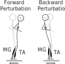

```{r, include = FALSE}
knitr::opts_chunk$set(
  echo = FALSE,
  message = FALSE,
  warning = FALSE,
  collapse = TRUE,
  comment = "#>"
)
```

```{r}
# set path variables
source("../paths.m")

# if csv files do not exist, run matlab batch steps to populate them
if (!file.exists("../csv/c.csv")|!file.exists("../tmp/m.csv")){
  system(paste(matlabCommand, "'cd ../m; loadData; exit'"))
}
```

# Introduction
This document describes the analysis of standing balance responses in people with and without multiple sclerosis (MS) using wavelet-based functional ANOVA (wfANOVA[@mckay2013]).
MS has profound effects on balance,[@vanliew2019] including altering protective stepping behaviors.[@peterson2016]
The main objective of this study was to examine the impact of MS on the pattern of magnitude and timing of muscle activation during feet-in-place balance responses.

# Methods


```{r loadData}
library(vroom)
library(dplyr)
library(magrittr)
library(stringr)
library(lubridate)
library(janitor)
library(kableExtra)
library(ggplot2)
library(cowplot)
`%contains%` = function(s, pattern) grepl(pattern, s)
`%omits%` = function(s, pattern) !grepl(pattern, s)
`%between%` = function(s, window) s>=min(window)&s<max(window)

# load participant-level information
m = vroom("../tmp/m.csv") %>% mutate(Group = "MS") %>% mutate(Age = round(age)) %>% mutate(Sex = toupper(gender)) %>% rename(Participant = Subj)
c = vroom("../tmp/c.csv") %>% mutate(Group = "Control") %>% mutate(Age = round(age)) %>% mutate(Sex = toupper(gender)) %>% rename(Participant = Subj)

# concatenate the participants. note that some of them appear to be coded as follow-ups. this is very useful, but may not be needed for the first report. they appear to be coded as such by the presence of "F1", "F2" in the participant name. convert this to a visit number (1, 2, 3, 4)
participants = full_join( m %>% select(-trial, -age, -gender) %>% distinct(), c %>% select(-trial, -age, -gender) %>% distinct() ) %>%
  mutate(`Visit Number` = ifelse(Participant %omits% "F\\d", 1, as.numeric(str_extract(str_extract(Participant, "F\\d"),"\\d"))+1)) %>% 
  mutate(`Visit Date` = date(dmy_hms(obsDate))) %>% select(-obsDate) %>% 
  mutate(`Visit ID` = Participant) %>% 
  mutate(`Visit Code` = str_extract(Participant, "F\\d")) %>% 
  mutate(Participant = str_replace(Participant, "F\\d", "")) %>% 
  mutate(Group = factor(Group, levels = c("MS","Control")))

# identify enrollment date for each participant and calculate amount of time
participants = participants %>% left_join(participants %>% group_by(Participant) %>% summarize(`Enrollment Date` = min(`Visit Date`, na.rm = TRUE))) %>% 
  mutate(`Time Since Enrollment (Days)` = ifelse(Group == "MS", `Visit Date` - `Enrollment Date`, 0))

# calculate amount of follow-up
followUp = participants %>% select(Group, Participant, `Time Since Enrollment (Days)`) %>% group_by(Group, Participant) %>% summarize(`Study Visits Available (n)` = n(), `Follow-Up Available (Days)` = max(`Time Since Enrollment (Days)`))

# consider only baseline data, and get rid of participants with missing minimal demographic data
participants %<>% filter(!`Visit ID` %contains% "F") %>% filter(!is.na(Age)) %>% filter(Sex %in% c("M","F")) %>% filter(Age>0)

# add a group condition - note that if_else in dplyr and ifelse in base r are different!
participants %<>% mutate(Group = if_else(Participant %contains% "MSC", "Control", "MS")) %>%
  mutate(Group = relevel(factor(Group), "Control")) %>% select(Group, Participant, Age, Sex, everything())
```

```{r layout}
# layout tables and figures
library(captioner)
tableNumbers <- captioner(prefix = "Table")
captionEmgMags = tableNumbers(name = "emgMags", caption = "Maximum EMG levels.")
captionDemographics = tableNumbers(name = "demographics", caption = "Clinical and demographic features of the study population.")

figureNumbers <- captioner(prefix = "Figure")
captionCartoon = figureNumbers(name = "cartoon", caption = "Perturbation directions used in testing protocol.")
captionRawEmg = figureNumbers(name = "rawEmg", caption = "EMG traces stratified by perturbation direction and study group, prior to normalization. Colors represent individual participants.")
```

## Data sources
This study analyzed existing electromyographic recordings during balance responses in people with and without MS.
An earlier analysis of a subset of these records is available.[@peterson2016]
Inclusion criteria for MS participants were as follows: diagnosis of MS by a MS neurologist and no relapses within 60 days.
Inclusion criteria for all participants included ability to walk 25 ft (7.6 m) without an assistive device, and no other known biomechanical or neurologic conditions affecting stepping or balance.

## Assessment protocol
Complete details of the assessment protocol are avaialble in an earlier report.[@huisinga2014] 
During each asssessment, subjects stood with arms folded across the chest, eyes open, with their feet at a fixed heel-to-heel distance of 10 cm on a set of 2 custom hydraulic force platforms that translated either forward or backward (`r figureNumbers("cartoon", display = "cite")`).
In this study, "perturbation direction" refers to the direction of postural sway caused by the surface translation.
Therefore, a backward perturbation refers to forward movement of the support surface causing backward body sway and the activation of tibialis anterior (TA),
whereas forward perturbations refer to backward translation of the support surface causing forward body sway and the activation of medial gastrocnemius (MG).
Six perturbations were delivered, three forward, followed by three backward.
Peak platform displacement was 4 cm, at a rate of 15 cm/s, which elicited feet-in-place balance corrections without stepping.

## Electromyography
Surface electromyography was recorded with pairs 2.5-cm^2^ surface electrodes placed approximately 2 cm apart, with a ground electrode on the lateral condyle. 
The activity of tibialis anterior (TA) and medial gastrocnemius (MG) were recorded.
For this analysis, we considered only the activity of tibialis anterior of the right leg.


***
```{r perturbationFigure, out.width = "25%", fig.align = "left", fig.cap = captionCartoon}

```
***

## Data processing
Each individual EMG record was registered to the onset of treadmill motion and resampled to a common sample rate (1 kHz), and processed (high-pass, 35 Hz, de- mean, rectify, low-pass, 40 Hz) as in previous studies.[@lang2019; @mckay2016]
Recorded EMG records were visualized stratified by disease state and perturbation direction (`r figureNumbers("rawEmg", display = "cite")`).

```{r}
# if trial-level data files do not exist, run matlab batch steps to populate them
if (!file.exists("../tmp/Participant.csv")|
    !file.exists("../tmp/Date.csv")|
    !file.exists("../tmp/Trial.csv")|
    !file.exists("../tmp/Time.csv")|
    !file.exists("../tmp/Treadmill.csv")|
    !file.exists("../tmp/Emg1.csv")|
    !file.exists("../tmp/Emg2.csv")|
    !file.exists("../tmp/Emg3.csv")|
    !file.exists("../tmp/Emg4.csv")){
  system(paste(matlabCommand, "'cd ../m; preprocessData; exit'"))
}

# code the trial-level information so that each is coded.
# this call also codes the groups and isolates first visits based on the subject code.
# finally, this code isolates the trial number and direction from the Trial code, _t1-_t6.
trialData = cbind(
  vroom("../tmp/Participant.csv", col_names = FALSE) %>% select(Participant = X1),
  vroom("../tmp/Date.csv", col_names = FALSE) %>% select(Date = X1),
  vroom("../tmp/Trial.csv", col_names = FALSE) %>% select(Trial = X1)
) %>% as_tibble() %>%
  mutate(Date = ymd(Date)) %>%
  mutate(`Code` = paste0("X", row_number())) %>% 
  mutate(`Study Group` = if_else(Participant %contains% "MSC", "Control", "MS")) %>% 
  mutate(Visit = if_else(Participant %contains% "F", "Follow-up", "Initial")) %>% 
  mutate(`Trial Number` = Trial %>% str_extract("_t\\d") %>% str_extract("\\d") %>% as.numeric()) %>% 
  mutate(`Perturbation Direction` = if_else(`Trial Number` <= 3, "Forward", "Backward"))

time = vroom("../tmp/Time.csv", col_names = FALSE) %>% select(Time = X1)
treadmill = vroom("../tmp/Treadmill.csv", col_names = FALSE)
emg1 = vroom("../tmp/Emg1.csv", col_names = FALSE)
emg2 = vroom("../tmp/Emg2.csv", col_names = FALSE)
emg3 = vroom("../tmp/Emg3.csv", col_names = FALSE)
emg4 = vroom("../tmp/Emg4.csv", col_names = FALSE)

# the treadmill records are not very useful, as they have not been cleaned up manually, so let's plan to assume Dan's coding of the study conditions.
# To your questions
#  
# 1)      We have bilateral TA and medial Gastroc. Specifically
# a.       Ch. 1= Rt. TA
# b.       Ch. 2= Lf. TA
# c.       Ch. 3= Rt. MG
# d.       Ch. 4= Lf. MG
# 2)      We have 6 trials per participant per visit (some people have multiple visits). Within each visit, they complete 6 trials…
# a.       First 3 are FORWARD steps / loss of balance (i.e. the treadmill belt moves backward underfoot)
# b.       Next 3 are BACKWARD steps / loss of balance (i.e. the treadmill belt moves forward underfoot)


# the dataset emg1 corresponds to right TA. reconfigure it to enable tidy plotting.
taR = time %>% cbind(emg1) %>% as_tibble() %>% tidyr::pivot_longer(-Time, names_to = "Code", values_to = "V") %>%
  mutate(Muscle = "Tibialis Anterior") %>% mutate(Side = "Right") %>% select(`Code`, Muscle, Side, everything())

# I cannot figure out how to get dplyr::left_join to join by a variable with backticks, so rename temporarily
taR %<>% left_join(trialData, by = "Code") %>% 
  select(`Study Group`,Participant, Date, Trial, `Code`, `Trial Number`, `Perturbation Direction`, Muscle, Side, everything()) %>% 
  arrange(`Study Group`, Participant, `Trial Number`, Time)

# note that a large amount of the data (40%) is follow-up, with different visit amounts. for now, let's just consider the initial visit.
taR %<>% filter(Visit == "Initial")

# consider only those participants for whom both some EMG and minimal demographic data are available.
includedParticipants = intersect(taR$Participant, participants$Participant)

# consider only a subset of participants if debugging
SP = FALSE
if (SP){
  includedParticipants = sample(includedParticipants, 60)
}

taR %<>% filter(Participant %in% includedParticipants)
participants %<>% filter(Participant %in% includedParticipants)

# here are the time records
taR %<>% mutate(Group = factor(`Study Group`, levels = c("Control", "MS"))) %>% select(-`Study Group`) %>% 
  mutate(`Perturbation Direction` = factor(`Perturbation Direction`, levels = c("Forward", "Backward")))

# here are the averages across like trials
taRAv = taR %>% group_by(Group, Participant, Muscle, Side, `Perturbation Direction`, Time) %>% summarize(V = mean(V, na.rm = TRUE)) %>% ungroup()

# to calculate normalization coefficients, average across like trials for each patient, limit to a particular normalization window, and calculate maximum values
taRNorm = taRAv %>% filter(Time %between% c(0.0, 1.0)) %>% group_by(Group, Participant, `Perturbation Direction`) %>% summarize(Vm = max(V, na.rm = TRUE)) %>% ungroup()
```

***
```{r rawEMG, out.width = "100%", fig.align = "left", fig.cap = captionRawEmg}
# p = ggplot(taR, aes(x = Time, y = V)) + geom_line(aes(color = Participant), show.legend = FALSE, alpha = 0.5) + facet_grid(Group ~ `Perturbation Direction`) + theme_minimal_grid() +
#   geom_jitter(mapping = aes(x = 0, y = Vm, color = Participant), data = taRNorm %>% left_join(participants %>% select(Participant, Group)), show.legend = FALSE, height = 0, width = 0.01)
# p
# p = ggplot(taR, aes(x = Time, y = V)) + geom_line(aes(color = Participant), show.legend = FALSE, alpha = 0.5) + facet_grid(Group ~ `Perturbation Direction`) + theme_minimal_grid() +
#   geom_label(mapping = aes(x = 0, y = Vm, color = Participant, label = Participant), data = taRNorm, show.legend = FALSE)
# p
p = ggplot(taR, aes(x = Time, y = V)) +
  geom_line(color = "Gray90", show.legend = FALSE, alpha = 0.5) +
  geom_line(aes(color = Participant), taRAv, show.legend = FALSE, alpha = 0.5) +
  facet_grid(Group ~ `Perturbation Direction`) +
  theme_minimal_grid() +
  geom_text(mapping = aes(x = 0, y = Vm, color = Participant, label = Participant), data = taRNorm %>% group_by(Group, `Perturbation Direction`) %>% top_n(3), show.legend = FALSE)
p
```

By visual inspection, there were some gross magnitude differences in recorded EMG levels between the MS and control groups, with higher EMG levels overall in the MS group.
EMG levels in most control participants (with the exception of MSC15 and MSC18) were generally roughly an order of magnitude lower than levels in MS participants.
This number is difficult to interpret, as it can reflect a large number of biological and methodological factors, so that increased absolute level among MS could reflect increased muscle activation or completely unrelated factors.
EMG levels were therefore normalized to the maximum values obtained in a 1 second window after perturbation onset after averaging across like trials (`r tableNumbers("emgMags", display = "cite")`).

```{r emgMags}
emgMags = 
  taRNorm %>% group_by(`Perturbation Direction`, Group) %>% summarize(Mean = mean(Vm) %>% round() ) %>% left_join(
    taRNorm %>% group_by(`Perturbation Direction`, Group) %>% summarize(SD = sd(Vm) %>% round() ) ) %>% left_join(
      taRNorm %>% group_by(`Perturbation Direction`, Group) %>% summarize(Max = max(Vm) %>% round() ) )
emgMags %>% kable(caption = captionEmgMags) %>% kable_styling(full_width = F, position = "left")

# 
# 
# ggplot(taRAv, aes(Time, Vn, color = Participant)) + geom_point(show.legend = FALSE) + facet_wrap(vars(`Perturbation Direction`))
# 
# p = ggplot(taRAv, aes(Time, Vn)) + geom_point()
# 
# p = ggplot(taRAv %>% group_by(Participant, `Perturbation Direction`), aes(x = Time, y = Vn, color = Participant)) +
#   facet_grid(Group ~ `Perturbation Direction`) +
#   theme_minimal_grid() +
#   coord_cartesian(xlim = c(0,1)) + 
#   geom_line(aes(group = Participant, color = Participant), taRav, show.legend = FALSE) +
# p
```

***

# Results

## Demographic and clinical characteristics
Demographic and clinical characteristics of the study population are summarized in `r tableNumbers("demographics", display = "cite")`.

***
```{r demographics}
participants %>% tabyl(Sex, Group) %>% mutate(Total = MS + Control) %>% 
  kable(caption = captionDemographics) %>% kable_styling(full_width = F, position = "left")
```
***

## Changes in tibialis anterior activity with disease state and perturbation direction


# Discussion

TK

***
### Funding sources and conflict of interest
This study was supported in part by National Institutes of Health grant K25HD086276.
The authors report no conflict of interest related to this study.

### Financial disclosures for the previous 12 months
Dr. McKay has received research funding or support from the National Institutes of Health. Dr. McKay has received consulting fees from BioCircuit Technologies.

***
# References

